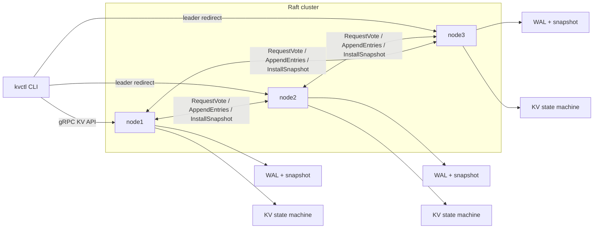

# go-raft-kv

`go-raft-kv` is an engineering-oriented Raft key-value service written in Go. It is designed to demonstrate leader election, log replication, leader-only writes, linearizable leader reads, WAL recovery, snapshot compaction, node restart catch-up, a gRPC API, a CLI, Docker Compose multi-node bootstrapping, and reproducible tests.

## 30-Second Summary

| Signal | Details |
| --- | --- |
| Positioning | Go distributed KV service for backend interviews: Raft consensus, durable logs, snapshots, and fault recovery. |
| Stack | Go 1.25, gRPC, Docker Compose, WAL JSONL storage, snapshot persistence, `kvctl` CLI. |
| Hard parts | Leader election, majority log replication, leader redirect, linearizable reads through quorum heartbeat, WAL recovery, snapshot install/catch-up. |
| Quick start | `docker compose up -d --build`; then `go run ./cmd/kvctl put user:1 alice` and `go run ./cmd/kvctl get user:1`. |
| Validation | `go test ./...`, `go test -race ./...`, `go vet ./...`, plus a 3-node Docker failover smoke test. |
| Benchmark / result | `BenchmarkSingleNodePut` documents WAL-backed write-path cost; local failover test shows 1-node failure tolerance in a 3-node cluster. |

## Architecture



## Project Layout

- `cmd/server`: starts one Raft KV node.
- `cmd/kvctl`: CLI for `put`, `get`, `delete`, `cas`, and `status`.
- `api/proto`: protobuf API contract for KV and Raft peer RPCs.
- `api`: hand-written gRPC service descriptors and JSON codec bindings.
- `internal/raft`: Raft role transitions, elections, replication, quorum reads, and snapshots.
- `internal/storage`: WAL, hard state, and snapshot persistence.
- `internal/server`: KV state machine, gRPC service, and gRPC peer transport.
- `tests`: in-memory multi-node fault tests and benchmarks.

## Raft Write Flow

1. A client sends `Put`, `Delete`, or `CAS` to any node.
2. Followers reject writes with a leader hint.
3. The leader appends the command to its local WAL.
4. The leader replicates the entry with `AppendEntries`.
5. Once a majority has the entry, the leader advances `commitIndex`.
6. Each node applies committed entries to the KV state machine in log order.
7. When live log entries exceed the snapshot threshold, the node persists a snapshot and truncates compacted WAL entries.

Reads are served by the leader through a quorum heartbeat barrier before reading the local state machine.

## Run With Docker Compose

```bash
docker compose up -d --build
go run ./cmd/kvctl put user:1 alice
go run ./cmd/kvctl get user:1
```

Expected output:

```text
OK
alice
```

The compose file exposes:

- `node1`: `127.0.0.1:9101`
- `node2`: `127.0.0.1:9102`
- `node3`: `127.0.0.1:9103`

## Fault Demo

```bash
go run ./cmd/kvctl status
docker compose stop node1
go run ./cmd/kvctl put user:2 bob
go run ./cmd/kvctl get user:2
docker compose start node1
go run ./cmd/kvctl get user:1
go run ./cmd/kvctl get user:2
```

If `node1` was not the leader, stop the node reported as leader by `kvctl status`. With any one node down, a three-node cluster keeps a majority and can still accept writes.

## Local Verification

The commands below were run with Go `1.25.10` via `mise`.

```bash
go test ./...
go test -race ./...
go vet ./...
```

Test matrix:

| Requirement | Coverage |
| --- | --- |
| leader election | `TestLeaderFailoverAndFollowerCatchUp` waits for a leader |
| log replication | writes are proposed through the leader and observed on followers |
| leader failover | old leader is stopped, remaining nodes elect a new leader |
| restart catch-up | stopped leader restarts from disk and catches up committed keys |
| one-node failure tolerance | `TestOneNodeDownStillAcceptsWrites` keeps writing with one follower down |
| WAL recovery | `TestWALRecoversHardStateAndLog` reloads term, vote, commit index, and log |
| snapshot compaction | `TestSnapshotCompactionAndRestartRecovery` checks snapshot persistence and WAL truncation |
| race safety | `go test -race ./...` |

## Benchmark Summary

Command:

```bash
go test -run '^$' -bench BenchmarkSingleNodePut -benchmem ./tests
```

Local result on Apple M4, in-memory transport, WAL fsync enabled:

```text
BenchmarkSingleNodePut-10    84    13470180 ns/op    4153 B/op    45 allocs/op
```

This benchmark is intentionally conservative because every proposal persists to the WAL. It is a smoke benchmark for write-path cost, not a network throughput claim.

## Notes

- `api/proto/kv.proto` is the external API contract. The Go implementation uses a hand-written gRPC descriptor plus JSON codec so the repository does not require `protoc` for normal development.
- Snapshot catch-up uses `InstallSnapshot` when a follower falls behind the leader's compacted log.
- The Docker image builds `server` and `kvctl`; the compose entrypoint runs `server`.
